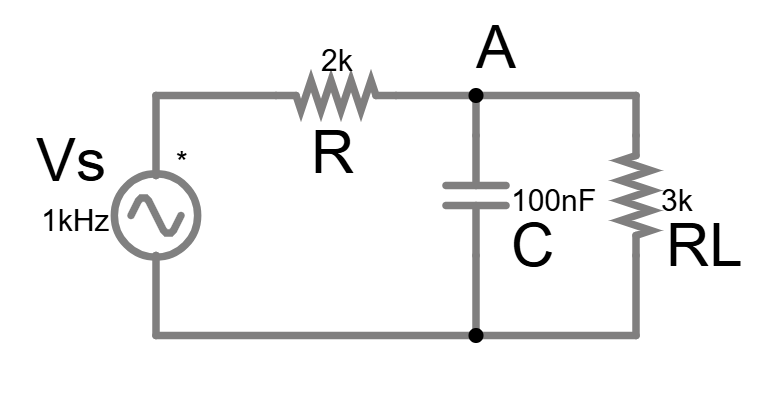
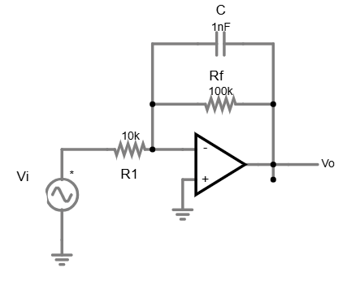
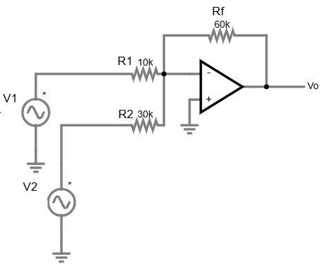
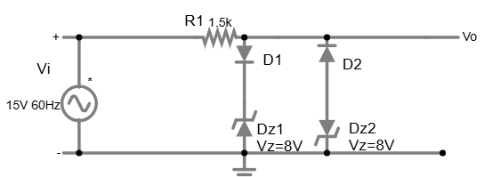
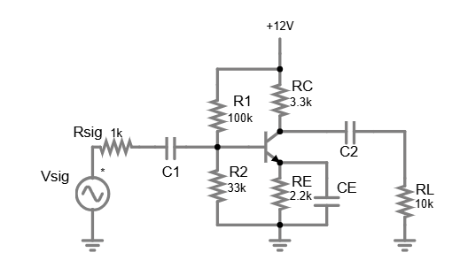

# Exame de Preparação — Electrónica UC 2025/2026

> **Nível:** equivalente a exame final UC  
> **Duração sugerida:** 3 horas  
> **Nota:** As figuras são adicionadas progressivamente à medida que ficam disponíveis.

---

## Pergunta 1 — Circuitos AC: Thévenin e Potência

> [Simular no Falstad ↗](https://www.falstad.com/circuit/circuitjs.html?ctz=DwYwlgTgBAZgvAIgIwKgFwM6IAwDpsEECsqYIiSeATAVQOx0DM2AHFQGwCcndqIARoiLZUAB0EIALI1QA3CENQBbTEICmAWiQoAfACgoUYLKgAPRJJZRmkqJaj0qqeAhFQA7i5SwFyQsoBDU1kKLl4oUQALAIw1AGVIsBg0ClwiOmw6TnZGDizLbPYEAHp9Q2BocwRsh0lsKCRJWyo65xxUXxoCErKjEDMKOnYHImGkIetsSTbXPlTCBcXCJE1wsBDXfGxvDF83WQATdtKDI0rEFvqqUdr6mxm3X2Zuk/L3AakrRzsv1thj3rAd5VeyXKA1S4PHqnIEfRrNOoNCaQ/6zV5GYGDYZg8bY0ZQ9Gwqq426klEuESEzEIMG0xHXIqoymA6lgmykxiMRkU6FvD5srlI4ac7kAmHUkkioWTaZM3kYuETKX2EUElkfFWClVTNUw0yK7FUTgNThUBy5KFQDBgC6ytBqRAAQXlwH1xMoDjoSAa9E9sp5VptNLtDoQACUXW6LkQzcwvmxrNpLdbbah7YgwwAZSNwzh3VgOTKJ7wBlPBtOhgDCOaqVzozS%2BDGTQZaFcQADUMNDgMVwBAdEA)

Fonte AC $v_s(t) = 12\sqrt{2}\cos(2\pi \times 1000 \cdot t)$ V (→ $V_s = 12\angle 0°$ V rms) em série com $R = 2\ \text{k}\Omega$. Nos terminais de saída (entre o nó A e a massa) estão em paralelo $C = 100\ \text{nF}$ e a carga $R_L = 3\ \text{k}\Omega$.

### 1a) Impedância do condensador a 1 kHz

$$Z_C = \frac{1}{j\omega C} = \frac{1}{j \cdot 2\pi \times 1000 \times 100 \times 10^{-9}}$$

$$\boxed{Z_C \approx -j1592\ \Omega \approx -j1.59\ \text{k}\Omega}$$

### 1b) Equivalente de Thévenin nos terminais de $R_L$ (desligar $R_L$)

**Tensão de Thévenin** (divisor de tensão $R$ e $Z_C$):

$$V_{Th} = V_s \cdot \frac{Z_C}{R + Z_C} = 12 \cdot \frac{-j1592}{2000 - j1592}$$

$$|V_{Th}| = 12 \cdot \frac{1592}{\sqrt{2000^2 + 1592^2}} = 12 \cdot \frac{1592}{2558} = \boxed{7.47\ \text{V rms}}$$

$$\angle V_{Th} = -90° + \arctan\!\left(\frac{1592}{2000}\right) = -90° + 38.5° = \boxed{-51.5°}$$

$$\boxed{V_{Th} = 7.47\angle{-51.5°}\ \text{V rms}}$$

**Impedância de Thévenin** ($V_s$ em curto-circuito):

$$Z_{Th} = R \| Z_C = \frac{R \cdot Z_C}{R + Z_C} = \frac{2000 \times (-j1592)}{2000 - j1592}$$

$$|Z_{Th}| = \frac{2000 \times 1592}{2558} = 1245\ \Omega \qquad \angle Z_{Th} = -90° + 38.5° = -51.5°$$

$$\boxed{Z_{Th} = 1245\angle{-51.5°}\ \Omega \approx 776 - j975\ \Omega}$$

### 1c) Corrente e tensão na carga $R_L$

$$I_L = \frac{V_{Th}}{Z_{Th} + R_L} = \frac{7.47\angle{-51.5°}}{(776 - j975) + 3000} = \frac{7.47\angle{-51.5°}}{3776 - j975}$$

$$|3776 - j975| = \sqrt{3776^2 + 975^2} = 3900\ \Omega \qquad \angle = -14.5°$$

$$\boxed{I_L = \frac{7.47}{3900}\angle(-51.5° + 14.5°) = 1.915\angle{-37°}\ \text{mA rms}}$$

$$\boxed{V_L = I_L \times R_L = 1.915 \times 3000 = 5.74\angle{-37°}\ \text{V rms}}$$

### 1d) Potência média dissipada em $R_L$

$$P_L = |I_L|^2 \cdot R_L = (1.915 \times 10^{-3})^2 \times 3000$$

$$\boxed{P_L = 11.0\ \text{mW}}$$

### 1e) Frequência de referência do circuito RC

A frequência característica onde $|Z_C| = R$:

$$\frac{1}{2\pi f_0 C} = R \implies f_0 = \frac{1}{2\pi RC} = \frac{1}{2\pi \times 2000 \times 100 \times 10^{-9}} \approx \boxed{796\ \text{Hz}}$$

A 1 kHz estamos **acima** de $f_0$: o condensador já tem impedância menor que $R$, por isso deixa passar bastante sinal — a atenuação do filtro RC a 1 kHz é inferior a 3 dB. Se $f \ll f_0$ o condensador bloqueia; se $f \gg f_0$ o condensador curto-circuita e a atenuação é máxima (toda a tensão cai em $R$).

---

## Pergunta 2 — Filtro Activo Passa-Baixo com AmOp

> [Simular no Falstad ↗](https://www.falstad.com/circuit/circuitjs.html?ctz=DwYwlgTgBAZgvAIgIwKgFwM6IAwDpsEECsqYIiSeATAVQOx0DM2AHFQGwCcndqIARoiLZUAB0EIALI1QA3CENQBbTEICmAWiQoAfACgoUYLKgAPRJJZRmkqJaj0qqeAhFQA7i5SwFyQsoBDU1kKLl4oUQALAIw1AGVIsBg0ClwiOmw6TnZGDizLbPYEAHp9Q2BocwRsh0lsKCRJWyo65xxUX0p/UoMjEDMKTioGqisW%2BqRRttc%2BCk1OUhDXfGxvDF83WQATdp7y9wGpMbph%2B3HpkT2jA6qzuqga89hdsuvDxub7pDp2WrcXS6vYA3CxWRiMX72GwXEpA0zvSgOOhIEacJGSGFQDBgCgkdBqRAAJRQV2A8Kq9XotiQjCR4QBqGxuNQaAJCAAamBYb1gAF3j8HERflQhYKis8ECxAsyoEocQgtHiAOYBCiEAjc8qVQbDJBDP4NIaYzrqwE88mIGjU9h0Bx6hoZTFM5B41lEmCaoxK/nCk4O37QiVm8re25giF2MFEJxBz3AAA2ADtDqMxqLwcKhZi3RyAPZxkEIRxI4bFkXihmkwtl0XlsUwqspv111P12ONqo1326o3toHVv160tfXuV/vvJoGj6GmNjnmF6dDmczhtwlPaB62qhUFFdJ3ypCutkAYQLTZ7pcHUz78/PIzGX2vc/2731kysi6fL1vVU/H8nQ6rnowDFOAEA6EAA==)

AmOp com alimentação $\pm 15$ V. Entrada $v_i$ ligada ao terminal $(-)$ através de $R_1 = 10\ \text{k}\Omega$. Malha de realimentação entre saída e $(-)$: $R_f = 100\ \text{k}\Omega$ em **paralelo** com $C_f = 1\ \text{nF}$. Terminal $(+)$ à massa.

### 2a) Função de transferência $H(j\omega) = V_o / V_i$

A impedância de realimentação é $R_f \| Z_{Cf}$:

$$Z_f = \frac{R_f \cdot \frac{1}{j\omega C_f}}{R_f + \frac{1}{j\omega C_f}} = \frac{R_f}{1 + j\omega R_f C_f}$$

O ganho do inversor com $Z_f$ na realimentação:

$$\boxed{H(j\omega) = -\frac{Z_f}{R_1} = -\frac{R_f/R_1}{1 + j\omega R_f C_f} = \frac{-10}{1 + j\omega/\omega_c}}$$

onde $\omega_c = 1/(R_f C_f)$.

### 2b) Ganho DC (para $f \to 0$, $C_f$ aberto)

$$H(0) = -\frac{R_f}{R_1} = -\frac{100\ \text{k}\Omega}{10\ \text{k}\Omega} = \boxed{-10\ \text{V/V} = -20\ \text{dB}}$$

(inversor com ganho 10 — o sinal é invertido)

### 2c) Frequência de corte $f_c$

$$\omega_c = \frac{1}{R_f C_f} = \frac{1}{100 \times 10^3 \times 1 \times 10^{-9}} = 10^4\ \text{rad/s}$$

$$\boxed{f_c = \frac{\omega_c}{2\pi} = \frac{10^4}{2\pi} \approx 1592\ \text{Hz} \approx 1.59\ \text{kHz}}$$

A esta frequência o ganho baixa para $-10/\sqrt{2} = -7.07$ V/V, ou seja $-3$ dB abaixo do DC.

### 2d) Ganho a $f = 10 f_c$

$$|H(j \cdot 10\omega_c)| = \frac{10}{\sqrt{1 + (10)^2}} = \frac{10}{\sqrt{101}} \approx \frac{10}{10.05} \approx 0.995\ \text{V/V}$$

Espera — para $f = 10 f_c$ o ganho já devia ser aproximadamente $10/(10) = 1$ V/V na aproximação de alta frequência. Em dB:

$$20\log(0.995) \approx -0.04\ \text{dB} \quad \text{... de ganho absoluto}$$

Mas o ganho DC é 10 V/V (20 dB) e a $f=10f_c$ o ganho cai para ≈ 1 V/V (0 dB). Isso é uma queda de 20 dB por década — exactamente o declive de um polo simples.

$$\boxed{\text{A } f = 10f_c:\ |H| \approx 1\ \text{V/V} = 0\ \text{dB} \qquad \text{Declive: } -20\ \text{dB/dec}}$$

### 2e) Limitação do GBW real (AmOp com GBW = 1 MHz)

Em malha fechada, a frequência de corte real está limitada pelo GBW do AmOp:

$$f_{3dB,malha\ fechada} = \frac{GBW}{|A_v^0|} = \frac{1 \times 10^6}{10} = \boxed{100\ \text{kHz}}$$

Como $f_c(RC) \approx 1.59\ \text{kHz} \ll 100\ \text{kHz}$, **o filtro é limitado pelo condensador**, não pelo AmOp — o AmOp tem largura de banda suficiente para este filtro. O GBW só seria limitante se precisássemos de $f_c > 100\ \text{kHz}$.

---

## Pergunta 3 — AmOp: Somador Inversor e Ganho Finito

> [Simular no Falstad ↗](https://www.falstad.com/circuit/circuitjs.html?ctz=DwYwlgTgBAZgvAIgIwKgFwM6IAwDpsEECsqYIiSeATAVQOx0DM2AHFQGwCcndqIARoiLZUAB0EIALI1QA3CENQBbTEICmAWiQoAfACgoUYLKgAPRFvZRmkqJaj0qqeAhFQA7i5SwFyQsoBDU1kKLl4oUQALAIw1AGVIsBg0ClwiOmw6TnZGDizJFmz2BAB6fUNgaHMEbIdJbCgkSVsqeuccVF9KfzKDI3czCyQrRzthurcXEV6Kger7VobaxfbXUvL%2BweRmica6EbbYDpnN%2BfHGRit7G1XpjeBTLZYRqk5G7CIHXNvUDDAKEjoNSIABKKBODy2GnSDjonw0jDe9BYPygfwBqDQwIQADVwfcAlskPsHEQRmTScUjggUVAlAEMXT/ggtICAOYMvyEO59SpEzhURoC3ZIAWo3zsbnrXmPao0WzDOgOUV7SYdNHMpCArGgmDSipsokk0bEqw3ak8g1Q86XMZmohOC36owAGwAdlsqCwWJTrLaqGTUTrcQB7Z3AOaIUYB8mxn4QyMIaMUr0%2BmPx%2B6J5MjOiC0WOqbhrO5oWCxaljO8xNNFr1Ro7fOV2ZEhvC/MVp0Qw3VcbNH299iSJtGWUWXLWZ5jWyMQqo9HIbXYnFOBNEqx9xrr4bDiNricK%2B0F473Ew9rdWc4sIdOjxeZxdfx0oIhZBhMTRWIJJIpZBpDJZHI8k4AoinDKpEFqGx62nbBr0LKBfGYHpMxbGCFR2FZO3uUcaSVV5PkoEZOFpeD5y1TFsRBFcULPawHU3axYJ3aszVgqBIKYrC9GAEpwAgHQgA=)

AmOp inversor com duas entradas. $V_1$ ligada ao terminal $(-)$ através de $R_1 = 10\ \text{k}\Omega$; $V_2$ ligada ao mesmo terminal $(-)$ através de $R_2 = 30\ \text{k}\Omega$. Malha de realimentação: $R_f = 60\ \text{k}\Omega$. Terminal $(+)$ à massa. Alimentação $\pm 13\ \text{V}$.

### 3a) Expressão de $V_o$ em função de $V_1$ e $V_2$

KCL no nó $(-)$ (com $V^- = V^+ = 0$ V pelo curto-circuito virtual):

$$\frac{V_1 - 0}{R_1} + \frac{V_2 - 0}{R_2} + \frac{V_o - 0}{R_f} = 0$$

$$\boxed{V_o = -\left(\frac{R_f}{R_1} V_1 + \frac{R_f}{R_2} V_2\right) = -\left(6V_1 + 2V_2\right)}$$

O somador pondera $V_1$ com ganho 6 e $V_2$ com ganho 2.

### 3b) Calcule $V_o$ para $V_1 = 1\ \text{V}$, $V_2 = -3\ \text{V}$

$$V_o = -(6 \times 1 + 2 \times (-3)) = -(6 - 6) = \boxed{0\ \text{V}}$$

*(Os dois termos cancelam-se exactamente — resultado interessante!)*

### 3c) Gama de $V_1$ que não causa saturação, com $V_2 = 1\ \text{V}$ fixo

$$V_o = -(6V_1 + 2 \times 1) = -6V_1 - 2$$

Condição de não saturação: $-13 \leq V_o \leq +13$ V

**Limite positivo** ($V_o = +13$):
$$-6V_1 - 2 = 13 \implies V_1 = -\frac{15}{6} = -2.5\ \text{V}$$

**Limite negativo** ($V_o = -13$):
$$-6V_1 - 2 = -13 \implies V_1 = \frac{11}{6} \approx 1.83\ \text{V}$$

$$\boxed{-2.5\ \text{V} \leq V_1 \leq 1.83\ \text{V}}$$

### 3d) Ganho real do canal $V_1$ com $A = 100\ 000$ V/V

Para o inversor com ganho nominal $|G| = R_f/R_1 = 6$, o factor $\beta = R_1/(R_1+R_f) = 10/(10+60) = 1/7$.

O ganho real em malha fechada:

$$G_{real} = \frac{-A}{1 + A\beta} = \frac{-100000}{1 + 100000/7} = \frac{-100000}{14287} \approx -6.9996\ \text{V/V}$$

### 3e) Erro percentual face ao ganho ideal

$$\text{Erro} = \frac{|G_{real}| - |G_{ideal}|}{|G_{ideal}|} \times 100 = \frac{6.9996 - 6}{6} \times 100$$

Espera — o ganho real é $6.9996$, não $6$... deixe-me recalcular:

$$G_{real} = \frac{-R_f/R_1}{1 + (1+R_f/R_1)/A} = \frac{-6}{1 + 7/100000} = \frac{-6}{1.00007} \approx -5.9996\ \text{V/V}$$

$$\boxed{\text{Erro} = \frac{6 - 5.9996}{6} \times 100 \approx 0.007\%}$$

Com $A = 100\ 000$ o erro é desprezável. O ganho finito só se torna limitante quando $A \lesssim 100 \times |G_{ideal}|$ — neste caso precisaríamos de $A \lesssim 600$ para sentir o erro.

---

## Pergunta 4 — Díodos: Zener e Rectificador de Precisão

> [Simular no Falstad ↗](https://www.falstad.com/circuit/circuitjs.html?ctz=DwYwlgTgBAZgvAIgIwKgFwM6IAwDpsEECsqYIiSeATAVQOx0DM2AHFQGwCcndqIARoiLZUAB0EIALI1QA3CENQBbTEICmAWiQoAfACgoUYNAAeiTuyhVJ2KEkmSrN1PAQioC5MJEB6fYeAAdygzBC1La1sLJ3dXX38jYND7R0i7OgjnWBwEPwMjExDEFgiqTjtsIitGKhccqAwwChJ0NUQAJRQ8gMLQjSI6KzoqjQchljq3VEbm1DQ2hAA1MFyE4AAbADsisKRM21GWGMn3ecQAalX84AATJShNpURFgC8J7KmoMCxkTXtUCA/dybRC1KD8WTFK4BF47FJQRhEKh2MbMSQnZQAe2eb2hBThREsiNsNFsiJkH3cMy8cwWrzgLEWeI221CNRJNgR7COkQxrWemOZWx24QRSKghzFYLitMQGmZvWaRMYjiQbARjF4lOmTRp/IQABEXl01ncHk9DXgta4UF8fkh8IQnc7aH90R4gagQch8FQ9thJOwkERJAxJCxbRD6jBdXgCOjukYbnCxml4fRpfUlNjLbheIngIrkOxkRxBmqkENYvVqcHZYaTddk6EqNYhqW27ztVBs4gDVbmbCW220VYR0i%2Bb2lriC0XrFVGIuhpXF%2Bw%2BbWWmdDS9arOdvOEZJylQWOVEZnPhv6/TGQr94xj3RK1QiDy6O6ZQ1dXX9Qbd2skgoDIYjHVIshlAtAIQVswLJGhjm1SCU1SOhkXhNEMSQ4cUI7RwMMQgCRT2KUUTwicCOuKD0PFGCpUwwjsJI1c6IogJZCIol4NFE93htNcoECG0XE8dh3CUABDExIRpLC5WItJuJYXiclk3ZOIOYjz3o64AHNkJI9DuW0gJMSgNRvSQThplERAakmExImwCkbKmBIAlEKBpKpchkHifJ3M82zph8uNCB4dhCRfZkfExfRgB8cAIB0IA===)

Fonte $v_i = 15\sin(\omega t)$ V. Em série: $R = 1.5\ \text{k}\Omega$. Dois ramos em paralelo na saída: ramo esquerdo D1 (ânodo em Vo) + Dz1 (Vz=8V, breakdown reverso) para massa — clipa em +8.7 V; ramo direito D2 (invertido, ânodo na base) + Dz2 (Vz=8V) para massa — clipa em −8.7 V.

<!-- Nota para o Miro: este é o clássico limitador duplo simétrico com Zener — dois ramos em paralelo opostos, cada um com um Zener + díodo em série. Veja Folha 4, ex. 7 ou 11. -->

### 4a) Análise para $v_i > 0$ (semiciclo positivo)

O ramo positivo conduz quando $v_o \geq V_Z + V_D = 8 + 0.7 = 8.7\ \text{V}$.

- Se $v_i < 8.7\ \text{V}$: ambos os díodos cortados, $v_o = v_i$ (sem corrente em $R$)
- Se $v_i \geq 8.7\ \text{V}$: ramo positivo conduz, $\boxed{v_o = V_Z + V_D = 8.7\ \text{V}}$

### 4b) Análise para $v_i < 0$ (semiciclo negativo)

Por simetria, o ramo negativo limita em $-(V_Z + V_D) = -8.7\ \text{V}$.

- Se $v_i > -8.7\ \text{V}$: $v_o = v_i$
- Se $v_i \leq -8.7\ \text{V}$: $\boxed{v_o = -8.7\ \text{V}}$

### 4c) Forma de onda de saída

$$v_o(t) = \begin{cases} +8.7\ \text{V} & v_i > +8.7\ \text{V} \\ v_i & -8.7\ \text{V} \leq v_i \leq +8.7\ \text{V} \\ -8.7\ \text{V} & v_i < -8.7\ \text{V} \end{cases}$$

Com $v_i^{pico} = 15\ \text{V} > 8.7\ \text{V}$: a saída é limitada simétricamente.

$$V_{o,max} = +8.7\ \text{V} \qquad V_{o,min} = -8.7\ \text{V}$$

A corrente máxima em $R$ quando limita: $i_R = (15 - 8.7)/1500 = 4.2\ \text{mA}$.

### 4d) Rectificador de precisão: porquê e como funciona

**Problema do rectificador convencional:** um díodo de silício tem queda $V_D \approx 0.7\ \text{V}$. Para sinais com amplitude $< 1\ \text{V}$, a queda é comparável ao sinal — o rectificador convencional distorce ou nem funciona.

**Solução — rectificador de precisão (super-díodo):**

O díodo é colocado na malha de realimentação do AmOp. Quando $v_i > 0$:
1. O AmOp detecta que $v_o < v_i$ e aumenta a sua saída interna
2. O díodo conduz e coloca a realimentação a funcionar
3. O AmOp eleva a sua saída exactamente $V_D$ a mais do que seria necessário — cancelando a queda do díodo
4. Resultado: $v_o = v_i$ exactamente, mesmo para $v_i = 1\ \text{mV}$

Quando $v_i < 0$: o AmOp tenta conduzir o díodo ao contrário — mas não consegue, o díodo corta, a realimentação abre, $v_o = 0$.

### 4e) Comparação para sinal de $v_i^{pico} = 50\ \text{mV}$

| Rectificador | $V_{o,max}$ | Funciona? |
|---|---|---|
| Meia-onda convencional (1 díodo) | $50 - 700 = -650\ \text{mV}$ | Díodo nunca conduz → $V_o = 0$ |
| Rectificador de precisão (AmOp) | $50\ \text{mV}$ | Funciona perfeitamente |

$$\boxed{\text{Para } v_i^{pico} < V_D,\text{ só o rectificador de precisão funciona}}$$

---

## Pergunta 5 — BJT: Polarização, Emissor-Comum e Bypass

> [Simular no Falstad ↗](https://www.falstad.com/circuit/circuitjs.html?ctz=DwYwlgTgBAZgvAIgIwKgFwM6IAwDpsEECsqYIiSeATAVQOx0DM2AHFQGwCcndqIARoiLZUAB0EIALI1QA3CENQBbTEICmAWiQoAfACgoUYAA8oxxBqKMojIkSgaqkm0Rap4CEVAxgKJdGqIAGo%2BAOYIAPT6hsCyZjg2LM7YLlTuFOyoAO4eKLAKCOxeSgCGxrI4uChRBkZo8chFNjRQSJxUzV4eXqIAdhSo/IHIwsoA9ogAJmowJQCuADZockM4K%2BSekdFG0ObIVCydrQdQVESZsGtQBZSEIjUxuxQnjC1IJ5IE6ZvXiIzMXweOwabQ6/3YrXaUE%2BXSuBSoNHu21ADScKVsHTR0K%2Blx%2BGzwd2w3GJJNJ3FIFU8%2BGweQwBS8skmayBwCeyChzGcoNOn2%2BXgK/0ByLZkkOrxS6JofNQN0IW1qrIa4tSRxh0t%2ByDu8piACUQVCEVyoaDvkgLjkrqVys9tUYsvrMZ9IZinNKWfa9tyse9Dmi3ciPc9fU6fadzv6FYH9mK3k1xRGYlHQzDndjYZt3Q60zyUmrcUiFaEsynuZIzQm7ainRiczZGBdurbgFGseDU%2BCKyi9uxnMrOBD4/m%2BJVCWSx8SKSOaag6VdGczkaZPZJnPRDmbrAc8o3vL4Rqg0MMddVFyDq0QkK0iJwXJJ1T4/Aej2kWUvEDRe%2BxL4abD373ukH8Q9EB1ABRJs3wQM50XYOhTjodEEP/R8AkQABhcDX1RbBV3YTczlOdgGyuB991QhAdTQiCGjoS9bEvTh0SIO8h13FDgIQNCTwVSDHHRShWn4mRWNIwCnxAsImyjJiOkldMC0TBpRSOHtOk7KN%2ByOUNB0bTNPQ5HDa05TsQCrdFDIOMUcPVfFqUIcdx0nKkCFpek5CZDNTz2M5rEFeCwX%2BZCyI4tCXy8v5GDorgXEQtIRIAoCjwAGSbIs9nRJIoFzcshxZNK/haFNlTLYjPMjJUWhrZVjNygMKvM1cWCsljdP0YAInACAdCAA)

NPN BJT, $\beta = 150$, $V_{BE} = 0.7\ \text{V}$, $V_{CC} = 12\ \text{V}$.
Divisor de base: $R_1 = 100\ \text{k}\Omega$ (de $V_{CC}$ à base), $R_2 = 33\ \text{k}\Omega$ (da base à massa).
$R_E = 2.2\ \text{k}\Omega$ (do emissor à massa). Condensador de bypass $C_E = \infty$ em paralelo com $R_E$.
$R_C = 3.3\ \text{k}\Omega$ (do colector a $V_{CC}$).
$R_{sig} = 1\ \text{k}\Omega$, $R_L = 10\ \text{k}\Omega$. Condensadores de acoplamento $C_1, C_2 = \infty$.

### 5a) Análise DC (ponto de funcionamento)

**Tensão de base** (divisor de tensão $R_1$, $R_2$ — válido pois $\beta R_E \gg R_1 \| R_2$):

$$V_B = V_{CC} \cdot \frac{R_2}{R_1 + R_2} = 12 \times \frac{33}{133} = \boxed{2.98\ \text{V}}$$

**Tensão e corrente de emissor:**

$$V_E = V_B - V_{BE} = 2.98 - 0.7 = \boxed{2.28\ \text{V}}$$

$$I_E = \frac{V_E}{R_E} = \frac{2.28}{2200} = \boxed{1.036\ \text{mA}}$$

**Corrente de colector** ($\alpha \approx 1$ para $\beta$ grande):

$$I_C \approx I_E = 1.036\ \text{mA}$$

**Tensão de colector:**

$$V_C = V_{CC} - I_C R_C = 12 - 1.036 \times 3.3 = 12 - 3.42 = \boxed{8.58\ \text{V}}$$

$$V_{CE} = V_C - V_E = 8.58 - 2.28 = \boxed{6.30\ \text{V}} \gg 0.2\ \text{V} \implies \textbf{região activa confirmada}$$

### 5b) Parâmetros do modelo de pequenos sinais

$$g_m = \frac{I_C}{V_T} = \frac{1.036\ \text{mA}}{25\ \text{mV}} = \boxed{41.4\ \text{mA/V}}$$

$$r_\pi = \frac{\beta}{g_m} = \frac{150}{41.4 \times 10^{-3}} = \boxed{3.62\ \text{k}\Omega}$$

### 5c) Resistência de entrada $R_{in}$

$$R_{in} = R_1 \| R_2 \| r_\pi = 100\text{k} \| 33\text{k} \| 3.62\text{k}$$

$$R_1 \| R_2 = \frac{100 \times 33}{133} = 24.8\ \text{k}\Omega$$

$$R_{in} = 24.8\text{k} \| 3.62\text{k} = \frac{24.8 \times 3.62}{24.8 + 3.62} = \frac{89.8}{28.4} = \boxed{3.16\ \text{k}\Omega}$$

### 5d) Ganho AC com $R_E$ bypassed ($C_E = \infty$)

A carga efectiva no colector:

$$R_C' = R_C \| R_L = 3.3\text{k} \| 10\text{k} = \frac{33}{13.3} = 2.48\ \text{k}\Omega$$

Ganho da base para a saída (emissor aterrado pelo condensador):

$$\frac{v_o}{v_i} = -g_m R_C' = -41.4 \times 10^{-3} \times 2480 = -102.7\ \text{V/V}$$

Ganho global (incluindo divisor $R_{sig}$ e $R_{in}$):

$$\frac{v_o}{v_{sig}} = \frac{v_o}{v_i} \cdot \frac{R_{in}}{R_{in} + R_{sig}} = -102.7 \times \frac{3.16}{3.16 + 1} = -102.7 \times 0.760 = \boxed{-78.1\ \text{V/V}}$$

### 5e) Ganho AC sem bypass em $R_E$ (condensador removido)

Com $R_E$ não contornado, aparece resistência de degeneração de emissor:

$$\frac{v_o}{v_{sig}} \approx \frac{-g_m R_C'}{1 + g_m R_E} \cdot \frac{R_{in}'}{R_{in}' + R_{sig}}$$

onde $R_{in}' = R_1 \| R_2 \| [r_\pi + (\beta+1)R_E]$:

$$r_\pi + (\beta+1)R_E = 3620 + 151 \times 2200 = 3620 + 332200 \approx 336\ \text{k}\Omega$$

$$R_{in}' = 24.8\text{k} \| 336\text{k} = \frac{24.8 \times 336}{360.8} = 23.1\ \text{k}\Omega$$

$$\frac{v_o}{v_{sig}} = \frac{-41.4 \times 10^{-3} \times 2480}{1 + 41.4 \times 10^{-3} \times 2200} \cdot \frac{23.1}{23.1 + 1}$$

$$= \frac{-102.7}{1 + 91.1} \times 0.959 = \frac{-102.7}{92.1} \times 0.959 = -1.115 \times 0.959 = \boxed{-1.07\ \text{V/V}}$$

### 5f) Comparação e análise

| Configuração | $|v_o/v_{sig}|$ | $R_{in}$ | Observação |
|---|---|---|---|
| Com bypass ($C_E = \infty$) | **78.1 V/V** | 3.16 kΩ | Alto ganho, baixa $R_{in}$ |
| Sem bypass ($R_E$ livre) | **1.07 V/V** | 23.1 kΩ | Baixo ganho, alta $R_{in}$, mais linear |

**O que acontece sem bypass:** $R_E$ introduz realimentação negativa local (degeneração de emissor). O ganho cai drasticamente de 78 para ≈1 V/V, mas a resistência de entrada sobe de 3.16 kΩ para 23.1 kΩ e a linearidade melhora. Esta é exactamente a mesma tradeoff do seguidor de emissor (coletor-comum), onde $R_E \to \infty$ e o ganho se aproxima de 1.

$$\boxed{\text{Bypass} \leftrightarrow \text{alto ganho + baixa } R_{in} \qquad \text{Sem bypass} \leftrightarrow \text{baixo ganho + alta } R_{in}}$$

---

## Resumo das respostas-chave

| P | Sub | Resultado |
|---|---|---|
| 1 | a | $Z_C = -j1592\ \Omega$ |
| 1 | b | $V_{Th} = 7.47\angle{-51.5°}$ V; $Z_{Th} = 1245\angle{-51.5°}\ \Omega$ |
| 1 | c | $I_L = 1.92\angle{-37°}$ mA; $V_L = 5.74\angle{-37°}$ V |
| 1 | d | $P_L = 11.0$ mW |
| 1 | e | $f_0 = 796$ Hz |
| 2 | b | DC gain = $-10$ V/V = $-20$ dB |
| 2 | c | $f_c = 1592$ Hz |
| 2 | d | $\approx -1$ V/V a $10f_c$; declive $-20$ dB/dec |
| 2 | e | GBW limita a 100 kHz; RC limita a 1.59 kHz → RC é o factor limitante |
| 3 | a | $V_o = -(6V_1 + 2V_2)$ |
| 3 | b | $V_o = 0$ V |
| 3 | c | $-2.5\ \text{V} \leq V_1 \leq 1.83\ \text{V}$ |
| 3 | e | Erro ≈ 0.007% |
| 4 | c | $V_{o,max} = +8.7$ V; $V_{o,min} = -8.7$ V |
| 4 | e | Rectificador convencional: $V_o = 0$; precisão: $V_o = 50$ mV |
| 5 | a | $V_B = 2.98$ V; $V_E = 2.28$ V; $I_C = 1.04$ mA; $V_C = 8.58$ V; região activa ✓ |
| 5 | b | $g_m = 41.4$ mA/V; $r_\pi = 3.62$ kΩ |
| 5 | c | $R_{in} = 3.16$ kΩ |
| 5 | d | $v_o/v_{sig} = -78.1$ V/V (com bypass) |
| 5 | e | $v_o/v_{sig} = -1.07$ V/V (sem bypass) |

---

## Recomendação de modelo

Para trabalhar neste projecto de tutoria recomendo **Claude Sonnet** (`claude-sonnet-4-6`):

- Rápido e económico para resolução iterativa de exercícios
- Suficiente para derivações matemáticas, KCL/KVL, análise de circuitos
- Reserve **Claude Opus** (`claude-opus-4-8`) apenas para questões conceptuais complexas ou quando precisar de raciocínio mais aprofundado (ex: derivações de modelo, análise de erros sistemáticos, questões abertas)
- Para gerar o site Docsify ou verificar código: qualquer modelo serve

> **Sonnet** para o dia-a-dia; **Opus** para as grandes questões.
