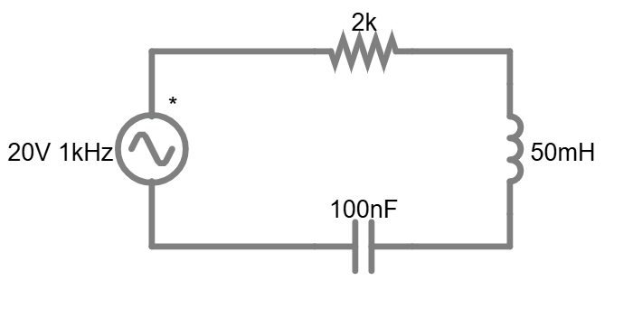
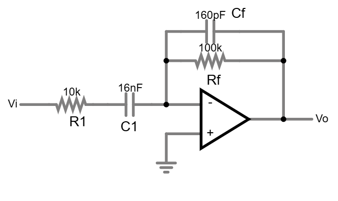
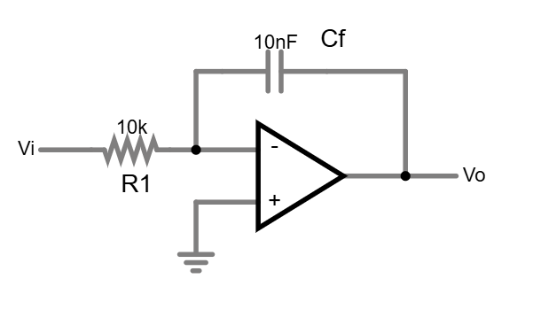
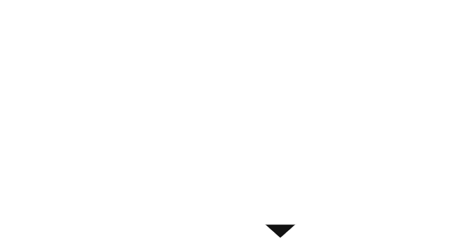

# Exame de Preparação 2 — Electrónica UC 2025/2026

> **5 questões — nível elevado**
> Cobre todos os tópicos do programa: circuitos AC, filtros activos, AmOp integrador, regulador Zener, BJT como interruptor.
> Tempo estimado: 2h30

---

## P1 — Circuito RLC em Regime Sinusoidal e Potência

**Dados:** $V_s = 20\angle 0°$ V (amplitude), $f = 1\,\text{kHz}$, $R = 2\,\text{k}\Omega$, $L = 50\,\text{mH}$, $C = 100\,\text{nF}$, todos em **série**.



[Simular no Falstad](falstad/circ_exam2_p1.txt)

**a)** Calcule as impedâncias $Z_R$, $Z_L$ e $Z_C$ a $f = 1\,\text{kHz}$.

**b)** Determine a impedância total $\mathbf{Z}$ (módulo e argumento). O circuito é indutivo ou capacitivo? Porquê?

**c)** Calcule o fasor da corrente $\mathbf{I}$.

**d)** Calcule os fasores de tensão $V_R$, $V_L$ e $V_C$. Verifique que $V_R + V_L + V_C = V_s$.

**e)** Calcule a potência activa $P$, a potência reactiva $Q$, a potência aparente $|S|$ e o factor de potência $FP$. Indique se é capacitivo ou indutivo.

**f)** Calcule a frequência de ressonância $f_0$. O que acontece ao circuito nessa frequência?

---

### Resolução P1

#### a) Impedâncias elementares

$$\omega = 2\pi \times 1000 = 6283{,}2\ \text{rad/s}$$

$$Z_R = 2000\ \Omega$$

$$Z_L = j\omega L = j \times 6283{,}2 \times 0{,}05 = j314{,}2\ \Omega$$

$$Z_C = \frac{1}{j\omega C} = \frac{-j}{6283{,}2 \times 100 \times 10^{-9}} = -j1591{,}5\ \Omega$$

#### b) Impedância total

$$\mathbf{Z} = Z_R + Z_L + Z_C = 2000 + j314{,}2 - j1591{,}5 = 2000 - j1277{,}3\ \Omega$$

$$|\mathbf{Z}| = \sqrt{2000^2 + 1277{,}3^2} = \sqrt{4{,}000{,}000 + 1{,}631{,}500} = 2373\ \Omega$$

$$\angle\mathbf{Z} = -\arctan\!\left(\frac{1277{,}3}{2000}\right) = -\arctan(0{,}639) = -32{,}6°$$

**O circuito é capacitivo** (parte imaginária de $\mathbf{Z}$ negativa, $|Z_C| > |Z_L|$), logo a corrente *adianta-se* em relação à tensão.

#### c) Fasor da corrente

$$\mathbf{I} = \frac{V_s}{\mathbf{Z}} = \frac{20\angle 0°}{2373\angle -32{,}6°} = 8{,}43\angle +32{,}6°\ \text{mA}$$

#### d) Tensões nos elementos

$$\mathbf{V}_R = \mathbf{I} \cdot R = 8{,}43 \times 10^{-3} \times 2000 \angle 32{,}6° = 16{,}86\angle 32{,}6°\ \text{V}$$

$$\mathbf{V}_L = \mathbf{I} \cdot Z_L = 8{,}43 \times 10^{-3} \times 314{,}2\angle 90° = 2{,}65\angle 122{,}6°\ \text{V}$$

$$\mathbf{V}_C = \mathbf{I} \cdot Z_C = 8{,}43 \times 10^{-3} \times 1591{,}5\angle -90° = 13{,}42\angle -57{,}4°\ \text{V}$$

**Verificação** (componentes reais e imaginárias):

| | Re | Im |
|---|---|---|
| $V_R$ | $+14{,}19$ | $+9{,}10$ |
| $V_L$ | $-1{,}43$ | $+2{,}23$ |
| $V_C$ | $+7{,}21$ | $-11{,}30$ |
| **Soma** | **≈ 20** ✓ | **≈ 0** ✓ |

#### e) Potências

Usando amplitudes (valores de pico):

$$P = \frac{1}{2}|V_s||\mathbf{I}|\cos(\angle\mathbf{Z}) = \frac{1}{2} \times 20 \times 8{,}43 \times 10^{-3} \times \cos(32{,}6°) = \boxed{71{,}0\ \text{mW}}$$

**Verificação:** $P = \frac{1}{2}|\mathbf{I}|^2 R = \frac{1}{2}(8{,}43 \times 10^{-3})^2 \times 2000 = 71{,}0\ \text{mW}$ ✓

$$Q = \frac{1}{2}|V_s||\mathbf{I}|\sin(\angle\mathbf{Z}) = \frac{1}{2} \times 20 \times 8{,}43 \times 10^{-3} \times \sin(-32{,}6°) = \boxed{-45{,}6\ \text{mVAr}}$$

Negativo → **reactância capacitiva dominante**.

$$|S| = \frac{1}{2}|V_s||\mathbf{I}| = \frac{1}{2} \times 20 \times 8{,}43 \times 10^{-3} = \boxed{84{,}3\ \text{mVA}}$$

$$FP = \cos(32{,}6°) = \boxed{0{,}842\ \text{(capacitivo / corrente adianta)}}$$

#### f) Frequência de ressonância

$$\omega_0 = \frac{1}{\sqrt{LC}} = \frac{1}{\sqrt{50 \times 10^{-3} \times 100 \times 10^{-9}}} = \frac{1}{\sqrt{5 \times 10^{-9}}} = 14{,}142\ \text{krad/s}$$

$$\boxed{f_0 = \frac{14142}{2\pi} \approx 2251\ \text{Hz}}$$

Em ressonância: $Z_L + Z_C = 0$, logo $\mathbf{Z} = R = 2\,\text{k}\Omega$ (mínimo de impedância), corrente máxima, $FP = 1$, $Q = 0$.

---

## P2 — Filtro Activo Passa-Banda com AmOp

**Dados:** AmOp ideal (depois analisa-se o efeito do GBW).
- Ramo de entrada: $R_1 = 10\,\text{k}\Omega$ em série com $C_1 = 16\,\text{nF}$
- Ramo de feedback: $R_f = 100\,\text{k}\Omega$ em paralelo com $C_f = 160\,\text{pF}$
- Montagem **inversora**



[Simular no Falstad](falstad/circ_exam2_p2.txt)

**a)** Derive a função de transferência $H(j\omega) = V_o/V_i$. Mostre que se trata de um **filtro passa-banda**.

**b)** Calcule as duas frequências de corte $f_L$ e $f_H$.

**c)** Determine o ganho na banda de passagem $|A_0|$ (em V/V e em dB).

**d)** Esboce o diagrama de Bode de $|H(j\omega)|$ (ganho em dB vs. frequência em escala logarítmica). Indique os declives assimptóticos.

**e)** O AmOp utilizado é um μA741 com $\text{GBW} = 1\,\text{MHz}$. O GBW limita a banda passante deste filtro? Justifique com cálculo.

---

### Resolução P2

#### a) Função de transferência

As impedâncias são:

$$Z_i = R_1 + \frac{1}{j\omega C_1} = \frac{1 + j\omega R_1 C_1}{j\omega C_1}$$

$$Z_f = R_f \,\bigg\|\, \frac{1}{j\omega C_f} = \frac{R_f}{1 + j\omega R_f C_f}$$

Para um AmOp inversor ideal:

$$H(j\omega) = -\frac{Z_f}{Z_i} = -\frac{R_f}{1 + j\omega R_f C_f} \cdot \frac{j\omega C_1}{1 + j\omega R_1 C_1}$$

$$\boxed{H(j\omega) = -\frac{j\omega R_f C_1}{\left(1 + j\dfrac{\omega}{\omega_L}\right)\!\left(1 + j\dfrac{\omega}{\omega_H}\right)}}$$

onde $\omega_L = 1/(R_1 C_1)$ e $\omega_H = 1/(R_f C_f)$.

**É um filtro passa-banda:**
- Para $\omega \to 0$: numerador $\to 0$ → $|H| \to 0$ (condensador $C_1$ bloqueia DC)
- Para $\omega \to \infty$: denominador $\propto \omega^2$, numerador $\propto \omega$ → $|H| \to 0$ (condensador $C_f$ em paralelo com $R_f$ curto-circuita o feedback)
- Máximo intermédio → passa-banda ✓

#### b) Frequências de corte

$$f_L = \frac{1}{2\pi R_1 C_1} = \frac{1}{2\pi \times 10000 \times 16 \times 10^{-9}} = \frac{1}{2\pi \times 1{,}6 \times 10^{-4}} \approx \boxed{995\ \text{Hz} \approx 1\ \text{kHz}}$$

$$f_H = \frac{1}{2\pi R_f C_f} = \frac{1}{2\pi \times 100000 \times 160 \times 10^{-12}} = \frac{1}{2\pi \times 1{,}6 \times 10^{-5}} \approx \boxed{9950\ \text{Hz} \approx 10\ \text{kHz}}$$

#### c) Ganho na banda de passagem

Na banda de passagem ($f_L \ll f \ll f_H$), ambos os denominadores $\approx j\omega/\omega_{L,H}$:

Para $f_L \ll f \ll f_H$:

$$|H| \approx \frac{\omega R_f C_1}{\omega / \omega_L} = \omega_L R_f C_1 = \frac{R_f C_1}{R_1 C_1} = \frac{R_f}{R_1}$$

$$|A_0| = \frac{R_f}{R_1} = \frac{100\,\text{k}}{10\,\text{k}} = \boxed{10\ \text{V/V} = 20\ \text{dB}}$$

(com inversão de fase: $\angle H = -90° - (-90°) + 180° = 180°$ em banda passante, típico do inversor)

#### d) Diagrama de Bode (esboço)

```
|H| (dB)
  20 |_ _ _ _ _ _ _ _ _ _ _
     |          /           \
      |        /             \
      |   +20 dB/déc   -20 dB/déc
      |      /                 \
    0 |-----/-------------------\-------> f (Hz)
           1k                 10k
          fL                  fH
```

- Abaixo de $f_L$: declive $+20\,\text{dB/déc}$ (zero no numerador domina)
- Entre $f_L$ e $f_H$: ganho constante $= 20\,\text{dB}$
- Acima de $f_H$: declive $-20\,\text{dB/déc}$ (polo do feedback domina)

#### e) Efeito do GBW

Para o AmOp a funcionar como amplificador inversor com ganho $|A_0| = 10$, a frequência máxima limitada pelo GBW é:

$$f_{\text{GBW}} = \frac{\text{GBW}}{|A_0|} = \frac{1\,\text{MHz}}{10} = 100\,\text{kHz}$$

Como $f_{\text{GBW}} = 100\,\text{kHz} \gg f_H = 10\,\text{kHz}$, **o GBW não limita** este filtro — a resposta do filtro cai antes de o AmOp perder ganho.

> **Nota:** Se o ganho fosse 1000 (e.g., $R_f = 10\,\text{M}\Omega$), então $f_\text{GBW} = 1\,\text{kHz} = f_L$ e o AmOp já não seria capaz de manter o ganho dentro da banda passante.

---

## P3 — AmOp Integrador

**Dados:** $R = 10\,\text{k}\Omega$, $C = 10\,\text{nF}$, AmOp ideal (montagem inversora com $C$ no feedback).



[Simular no Falstad](falstad/circ_exam2_p3.txt)

**a)** Derive $H(j\omega) = V_o/V_i$. Mostre que o circuito é um integrador e determine a constante de tempo $\tau$.

**b)** Para $v_i(t) = 2\cos(2\pi \times 1000\, t)$ V, calcule $|H|$ e $\angle H$, e escreva $v_o(t)$.

**c)** Repita a alínea b) para $f = 100\,\text{Hz}$.

**d)** Com base nas alíneas b) e c), o que caracteriza a resposta em frequência de um integrador ideal? Trace o Bode de $|H|$ em dB vs. $\log f$.

**e)** Se $v_i(t)$ for uma onda quadrada de amplitude $2\,\text{V}$ e frequência $1\,\text{kHz}$, descreva qualitativamente $v_o(t)$ e justifique.

---

### Resolução P3

#### a) Função de transferência

$$H(j\omega) = -\frac{Z_f}{Z_i} = -\frac{1/(j\omega C)}{R} = -\frac{1}{j\omega RC}$$

Com $\tau = RC = 10\times10^3 \times 10\times10^{-9} = 10^{-4}\ \text{s}$:

$$\boxed{H(j\omega) = -\frac{1}{j\omega\tau} = \frac{1}{\omega\tau}\angle{+90°}}$$

No domínio do tempo: $v_o(t) = -\dfrac{1}{\tau}\displaystyle\int v_i(t)\,dt$ — **integrador inversor** com constante de tempo $\tau = 0{,}1\,\text{ms}$.

> Intuição: $-1/j = +j$, portanto o módulo cai 20 dB/déc com a frequência e a fase é sempre $+90°$.

#### b) Para $f = 1\,\text{kHz}$

$$\omega = 2\pi \times 1000 = 6283{,}2\ \text{rad/s}$$

$$|H| = \frac{1}{\omega\tau} = \frac{1}{6283{,}2 \times 10^{-4}} = \frac{1}{0{,}6283} = \boxed{1{,}592}$$

$$\angle H = +90°$$

$$\mathbf{V}_o = 1{,}592\angle 90° \times 2\angle 0° = 3{,}18\angle 90°\ \text{V}$$

$$\boxed{v_o(t) = 3{,}18\cos(2\pi\times1000\,t + 90°) = -3{,}18\sin(2\pi\times1000\,t)\ \text{V}}$$

**Verificação directa no tempo:**

$$v_o = -\frac{1}{\tau}\int 2\cos(\omega t)\,dt = -\frac{1}{10^{-4}}\cdot\frac{2\sin(\omega t)}{\omega} = -\frac{2 \times 10^4}{6283{,}2}\sin(\omega t) = -3{,}18\sin(\omega t)\ \text{V}\ \checkmark$$

#### c) Para $f = 100\,\text{Hz}$

$$\omega = 2\pi \times 100 = 628{,}3\ \text{rad/s}$$

$$|H| = \frac{1}{628{,}3 \times 10^{-4}} = \frac{1}{0{,}06283} = \boxed{15{,}92}$$

$$\angle H = +90°$$

$$\boxed{v_o(t) = 2 \times 15{,}92\cos(2\pi\times100\,t + 90°) = -31{,}8\sin(2\pi\times100\,t)\ \text{V}}$$

#### d) Bode e característica do integrador

| $f$ | $\omega\tau$ | $\|H\|$ | $\|H\|$ (dB) |
|---|---|---|---|
| 100 Hz | 0,0628 | 15,92 | +24,0 dB |
| 1 kHz | 0,6283 | 1,592 | +4,0 dB |
| 10 kHz | 6,283 | 0,1592 | −15,96 dB |

**Declive de $-20\,\text{dB/déc$}$**: quando $f$ aumenta 10×, $|H|$ cai 10× (= 20 dB). O integrador ideal tem ganho infinito para $f \to 0$ — razão pela qual qualquer offset DC envia a saída para a saturação (problema prático).

#### e) Onda quadrada como entrada

Uma onda quadrada é a alternância de $+2\,\text{V}$ e $-2\,\text{V}$.

O integrador de um degrau constante $+A$ produz uma **rampa**:

$$v_o = -\frac{A}{\tau}\,t$$

Durante o semiciclo positivo ($v_i = +2\,\text{V}$):

$$\text{declive} = -\frac{2}{10^{-4}} = -20\,000\ \text{V/s} = -20\ \text{V/ms}$$

Durante $T/2 = 0{,}5\,\text{ms}$: $\Delta v_o = -10\,\text{V}$ (rampa descendente).

Durante o semiciclo negativo ($v_i = -2\,\text{V}$): rampa ascendente de $+10\,\text{V}$.

**$v_o(t)$ é uma onda triangular** com amplitude de pico $5\,\text{V}$ e frequência $1\,\text{kHz}$.

> Na prática, o AmOp saturaria ($\pm V_{CC}$) porque a amplitude da onda triangular excede a alimentação. Seria necessário reduzir a amplitude de $v_i$ ou usar um integrador com resistência de reset.

---

## P4 — Regulador de Tensão com Zener

**Dados:** Tensão de entrada DC não-regulada $V_{in} = 15\,\text{V}$ (fornecida por um rectificador + filtro), $R = 560\,\Omega$, díodo Zener com $V_z = 9\,\text{V}$ e $P_{z,\text{máx}} = 500\,\text{mW}$, carga $R_L = 2{,}7\,\text{k}\Omega$.



[Simular no Falstad](falstad/circ_exam2_p4.txt)

**a)** Determine a tensão de saída $V_o$. Verifique que o Zener está a regular (condição de regulação).

**b)** Calcule as correntes $I_R$, $I_L$ e $I_Z$.

**c)** Calcule a potência dissipada no Zener. Está dentro do limite?

**d)** Qual o valor mínimo de $R_L$ (máxima carga) para que o regulador ainda funcione?

**e)** Qual o valor mínimo de $V_{in}$ (com $R_L = 2{,}7\,\text{k}\Omega$) para que o Zener ainda regule?

**f)** Qual o valor máximo de $V_{in}$ antes do Zener ser destruído (com $R_L = 2{,}7\,\text{k}\Omega$)?

---

### Resolução P4

#### a) Tensão de saída e condição de regulação

O Zener em condução inversa fixa:

$$\boxed{V_o = V_z = 9\ \text{V}}$$

**Condição de regulação:** é necessário que $I_Z > 0$ (Zener a conduzir). Verificamos na alínea b).

#### b) Correntes

$$I_L = \frac{V_o}{R_L} = \frac{9}{2700} = \boxed{3{,}33\ \text{mA}}$$

$$I_R = \frac{V_{in} - V_z}{R} = \frac{15 - 9}{560} = \frac{6}{560} = \boxed{10{,}71\ \text{mA}}$$

$$I_Z = I_R - I_L = 10{,}71 - 3{,}33 = \boxed{7{,}38\ \text{mA}} > 0\ \checkmark \quad \text{(Zener a regular)}$$

#### c) Potência no Zener

$$P_Z = V_z \times I_Z = 9 \times 7{,}38 \times 10^{-3} = \boxed{66{,}4\ \text{mW}} \ll 500\ \text{mW}\ \checkmark$$

#### d) $R_{L,\text{min}}$ (máxima corrente de carga)

O regulador deixa de funcionar quando $I_Z = 0$ (todo o $I_R$ vai para a carga):

$$I_{L,\text{máx}} = I_R = 10{,}71\ \text{mA} \quad \text{(com } V_{in} = 15\,\text{V}\text{)}$$

$$\boxed{R_{L,\text{min}} = \frac{V_z}{I_{L,\text{máx}}} = \frac{9}{10{,}71 \times 10^{-3}} = 840\ \Omega}$$

Para $R_L < 840\,\Omega$, a carga "puxa" mais corrente do que $I_R$ fornece, o Zener deixa de conduzir e $V_o$ cai abaixo de $9\,\text{V}$.

#### e) $V_{in,\text{min}}$

Com $R_L = 2{,}7\,\text{k}\Omega$, para regular precisa-se $I_Z \geq 0$, i.e., $I_R \geq I_L$:

$$\frac{V_{in} - V_z}{R} \geq I_L$$

$$V_{in} \geq V_z + I_L \times R = 9 + 3{,}33 \times 10^{-3} \times 560 = 9 + 1{,}86 = \boxed{10{,}86\ \text{V}}$$

#### f) $V_{in,\text{máx}}$

O Zener é destruído quando $P_Z = P_{z,\text{máx}}$:

$$I_{Z,\text{máx}} = \frac{P_{z,\text{máx}}}{V_z} = \frac{0{,}500}{9} = 55{,}6\ \text{mA}$$

$$I_{R,\text{máx}} = I_{Z,\text{máx}} + I_L = 55{,}6 + 3{,}33 = 58{,}9\ \text{mA}$$

$$\boxed{V_{in,\text{máx}} = V_z + I_{R,\text{máx}} \times R = 9 + 58{,}9 \times 10^{-3} \times 560 = 9 + 33{,}0 = 42{,}0\ \text{V}}$$

---

## P5 — BJT como Interruptor: Inversor Digital

**Dados:** $V_{CC} = 5\,\text{V}$, $R_C = 1\,\text{k}\Omega$, $R_B = 10\,\text{k}\Omega$, BJT NPN com $\beta = 100$, $V_{BE,\text{on}} = 0{,}7\,\text{V}$, $V_{CE,\text{sat}} = 0{,}2\,\text{V}$.


[Simular no Falstad](falstad/circ_exam2_p5.txt)

**a)** Para $V_{IN} = 0\,\text{V}$: determine o estado do BJT, calcule $I_B$, $I_C$ e $V_O$.

**b)** Para $V_{IN} = 5\,\text{V}$: assuma saturação, calcule $I_B$ e $I_{C,\text{sat}}$. Confirme que o BJT está saturado calculando $\beta_{\text{forçado}}$.

**c)** Calcule o valor mínimo de $V_{IN}$ necessário para garantir a saturação.

**d)** Trace a **característica de transferência de tensão (VTC)**: $V_O$ em função de $V_{IN}$, identificando as três regiões (corte, activa, saturação).

**e)** Calcule a potência total dissipada pelo circuito em cada um dos dois estados lógicos (ON e OFF). Qual é o estado mais eficiente?

---

### Resolução P5

#### a) $V_{IN} = 0\,\text{V}$ — Estado CORTE

$$V_{BE} = V_{IN} - 0 = 0\,\text{V} < 0{,}7\,\text{V} \implies \text{BJT em CORTE}$$

$$I_B = 0,\quad I_C = 0$$

$$\boxed{V_O = V_{CC} - I_C R_C = 5 - 0 = 5\,\text{V} \quad \text{(lógico "1")}}$$

#### b) $V_{IN} = 5\,\text{V}$ — Verificação de saturação

**Corrente de base disponível:**

$$I_B = \frac{V_{IN} - V_{BE}}{R_B} = \frac{5 - 0{,}7}{10\,000} = \frac{4{,}3}{10\,000} = \boxed{0{,}43\,\text{mA}}$$

**Corrente de colector em saturação:**

$$I_{C,\text{sat}} = \frac{V_{CC} - V_{CE,\text{sat}}}{R_C} = \frac{5 - 0{,}2}{1000} = \boxed{4{,}8\,\text{mA}}$$

**Beta forçado:**

$$\beta_{\text{forçado}} = \frac{I_{C,\text{sat}}}{I_B} = \frac{4{,}8\,\text{mA}}{0{,}43\,\text{mA}} = 11{,}2 \ll \beta = 100 \implies \textbf{BJT em SATURAÇÃO}\ \checkmark$$

$$\boxed{V_O = V_{CE,\text{sat}} = 0{,}2\,\text{V} \quad \text{(lógico "0")}}$$

> **Regra:** um BJT NPN está em saturação se $\beta_{\text{forçado}} < \beta$. Neste caso, $I_B$ "sobre-excita" a base — há base suficiente para fornecer ainda mais $I_C$, mas $R_C$ limita.

#### c) $V_{IN,\text{min}}$ para saturação

A condição de saturação é $I_B \geq I_{C,\text{sat}}/\beta$:

$$I_{B,\text{min}} = \frac{I_{C,\text{sat}}}{\beta} = \frac{4{,}8 \times 10^{-3}}{100} = 48\,\mu\text{A}$$

$$V_{IN,\text{min}} = I_{B,\text{min}} \times R_B + V_{BE} = 48 \times 10^{-6} \times 10\,000 + 0{,}7 = 0{,}48 + 0{,}7 = \boxed{1{,}18\,\text{V}}$$

#### d) Característica de transferência (VTC)

| Região | Condição de $V_{IN}$ | $V_O$ |
|---|---|---|
| **Corte** | $V_{IN} < 0{,}7\,\text{V}$ | $5\,\text{V}$ |
| **Activa** | $0{,}7\,\text{V} \leq V_{IN} \leq 1{,}18\,\text{V}$ | $V_{CC} - \beta\dfrac{V_{IN}-V_{BE}}{R_B}R_C = 12 - 10\,V_{IN}$ |
| **Saturação** | $V_{IN} > 1{,}18\,\text{V}$ | $0{,}2\,\text{V}$ |

Na região activa:
- $V_{IN} = 0{,}7\,\text{V}$: $V_O = 12 - 10(0{,}7) = 5\,\text{V}$ ✓ (contínuo com o corte)
- $V_{IN} = 1{,}18\,\text{V}$: $V_O = 12 - 10(1{,}18) = 0{,}2\,\text{V}$ ✓ (contínuo com a saturação)

```
Vo (V)
  5 |____
     |    \
     |     \   <-- declive -10 V/V
     |      \
  0.2|       |__________
     +--+----+-----------> VIN (V)
       0.7  1.18
```

#### e) Potência dissipada

**Estado OFF** ($V_{IN} = 0\,\text{V}$, BJT em corte):

$$P_{\text{OFF}} = V_{CC} \times (I_C + I_B) = 5 \times (0 + 0) = \boxed{0\,\text{W}}$$

(Não há corrente — nenhuma potência dissipada.)

**Estado ON** ($V_{IN} = 5\,\text{V}$, BJT em saturação):

- Ramo do colector: $P_{CC,C} = V_{CC} \times I_{C,\text{sat}} = 5 \times 4{,}8 \times 10^{-3} = 24\,\text{mW}$
  - Dissipado em $R_C$: $I_{C,\text{sat}}^2 \times R_C = (4{,}8 \times 10^{-3})^2 \times 1000 = 23{,}0\,\text{mW}$
  - Dissipado no BJT (CE): $V_{CE,\text{sat}} \times I_{C,\text{sat}} = 0{,}2 \times 4{,}8 \times 10^{-3} = 0{,}96\,\text{mW}$
- Ramo da base: $P_{IN,B} = V_{IN} \times I_B = 5 \times 0{,}43 \times 10^{-3} = 2{,}15\,\text{mW}$
  - Em $R_B$: $1{,}85\,\text{mW}$; no BJT (BE): $0{,}30\,\text{mW}$

$$P_{\text{ON,total}} = 24 + 2{,}15 = \boxed{26{,}2\,\text{mW}}$$

$$P_{\text{BJT,ON}} = 0{,}96 + 0{,}30 = \boxed{1{,}26\,\text{mW}}$$

**O estado OFF é energeticamente mais eficiente** (potência nula). Esta é a base da lógica digital CMOS, onde em regime estático um dos dois transistores está sempre em corte.

---

## Resumo de Resultados

| | P1 | P2 | P3 | P4 | P5 |
|---|---|---|---|---|---|
| **Tema** | RLC + potência | Filtro passa-banda | Integrador | Regulador Zener | BJT inversor |
| **Resultado-chave** | $FP = 0{,}842$ cap. | $f_L=1\,\text{kHz}$, $f_H=10\,\text{kHz}$, $A_0=20\,\text{dB}$ | $v_o = -3{,}18\sin(\omega t)$ a 1 kHz | $V_o=9\,\text{V}$, $I_Z=7{,}4\,\text{mA}$ | $V_{IN,\text{min}}=1{,}18\,\text{V}$ |

<!-- Nota para o Miro: figuras a desenhar — ver todo_figuras.md para nomes exactos e descrições detalhadas. Falstad: P4 (Zener regulador) e P5 (BJT com RB e RC) são os mais simples de montar. -->
